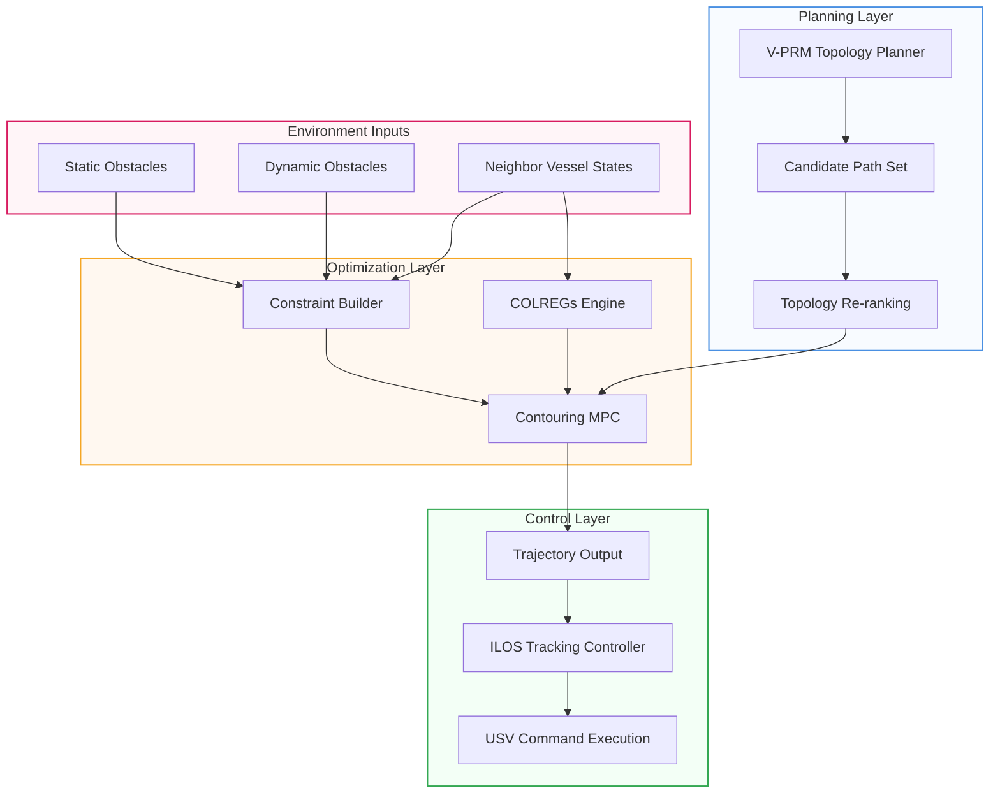

[](LICENSE)


# Multi-USV COLREGs Planner

A **multi-USV cooperative collision avoidance planner** integrating contouring MPC, V-PRM topology-driven path selection, and COLREGs-compliant navigation in ROS 2 (Jazzy).

| Multi-USV COLREGs Demonstration |
| ------------------------------- |
|  |

---

## Table of Contents
1. [Features](#features)
2. [System Architecture](#system-architecture)
3. [Installation](#installation)
4. [Usage](#usage)
5. [Configuration](#configuration)
6. [Dependencies & Acknowledgments](#dependencies--acknowledgments)
7. [License](#license)
8. [Citing](#citing)

## Features

- **Multi-USV Coordination** — Inter-vessel state broadcast and cooperative collision avoidance.
- **COLREGs Compliance** — Implements Rules 14 (Head-on), 15 (Crossing), 16 (Give-way), and 17 (Stand-on) with speed modulation.
- **V-PRM Topology Planning** — Voronoi-based Parallel Roadmap generates multiple distinct topological trajectories; the planner selects and re-ranks candidates online.
- **Contouring MPC** — Real-time trajectory optimization via **acados** solver with ellipsoidal obstacle constraints and DecompUtil safety corridors.
- **Dynamic Obstacle Prediction** — Predicts floating debris trajectories with 5-step rollout and gradient-transparency visualization.
- **Deadlock Prevention** — Stuck recovery detection (6 s stagnation) triggers a 4 s recovery window with minimum forward speed.
- **RViz Visualization** — Per-vessel visual seam (planned trajectory, topology candidates, obstacle ghost disks) inspired by the [mpc_planner](https://github.com/tud-amr/mpc_planner) visualizer.
- **Batch Experiment Pipeline** — Python-based experiment runner (`run_experiments.py`) for automated multi-episode evaluation.

## System Architecture



## Installation

### Prerequisites

- **ROS 2 Jazzy** (Ubuntu 24.04)
- C++17 compiler
- Python 3.10+
- [acados](https://docs.acados.org/) v1.4+
- Eigen 3.4
- DecompUtil (included as submodule)

### Build

```bash
cd core_ws
colcon build --packages-select multi_usv_planner
source install/setup.bash
```

### Acados Solver Setup

The contouring MPC solver is generated using the acados Python interface:

```bash
cd core_ws/src/multi_usv_planner
python3 scripts/generate_contouring_solver.py
```

Ensure the `ACADOS_SOURCE_DIR` and `LD_LIBRARY_PATH` environment variables point to your acados installation.

## Usage

### Launch Multi-USV Simulation

```bash
ros2 launch multi_usv_planner planner.launch.py
```

This launches:
- 3 USV planner nodes (USV 1–3)
- 1 floating debris node (dynamic obstacles)
- 1 scene visualizer node (static obstacles)
- RViz2 with pre-configured visualization

### Run Batch Experiments

```bash
cd core_ws
python3 src/multi_usv_planner/scripts/run_experiments.py
```

### Single USV Mode

```bash
ros2 launch multi_usv_planner planner_single.launch.py
```

## Configuration

Key configuration files are in `core_ws/src/multi_usv_planner/config/`:

| File | Purpose |
|------|---------|
| `usv_params.yaml` | Default USV parameters (MPC horizon, speeds, COLREGs settings) |
| `usv_params_easy.yaml` | Easy scenario parameters |
| `usv_params_medium.yaml` | Medium scenario parameters |
| `usv_params_hard.yaml` | Hard scenario parameters |

### Key Parameters

- `N` — MPC prediction horizon (default: 32)
- `dt` — Time step per horizon stage (default: 0.2 s)
- `desired_speed` — Nominal USV cruising speed (default: 1.2 m/s)
- `obstacle_clearance` — Safety clearance around obstacles (default: 2.5 m)
- `colregs_enabled` — Enable COLREGs speed modulation (default: true)
- `topology_rerank_candidates` — Number of V-PRM candidates to evaluate (default: 4)
- `episode_timeout_s` — Maximum episode duration before timeout (default: 600 s)

## Dependencies & Acknowledgments

This project builds upon open-source work from the robotics community. We are grateful for their contributions, which were instrumental in the development of our system.

### Core Dependencies

| Dependency | Purpose | Source |
|-----------|---------|--------|
| [ROS 2 Jazzy](https://docs.ros.org/en/jazzy/) | Robot operating system & middleware | Open Robotics |
| [acados](https://docs.acados.org/) | Real-time NMPC solver | [acados GitHub](https://github.com/acados/acados) |
| [Eigen 3](https://eigen.tuxfamily.org/) | Linear algebra library | Eigen Project |
| [DecompUtil](https://github.com/oscardegroot/DecompUtil) | Ellipsoidal decomposition for safe corridors | S. Liu et al. |

### Special Acknowledgments

We would like to express our sincere gratitude to the following projects and individuals:

1. **[mpc_planner](https://github.com/tud-amr/mpc_planner)** by O. de Groot et al. (TU Delft) — The architecture of our contouring MPC visualizer (per-vessel trajectory seam, topology candidates, and obstacle disks) was inspired by the excellent visualization design from this project. Their modular MPC framework and the T-MPC++ approach for topology-driven parallel trajectory optimization provided valuable reference for our visualization and evaluation pipeline. We also thank the authors for making their code open-source, which greatly accelerated our development.

2. **[teb_local_planner](https://github.com/rst-tu-dortmund/teb_local_planner)** by C. Rösmann et al. (TU Dortmund) — The Timed-Elastic-Band approach for local trajectory optimization informed our understanding of real-time trajectory deformation in dynamic environments. The clear separation between trajectory optimization and constraint formulation in TEB provided useful design patterns.

3. **[A-physical-simulator-for-ECA-A9](https://github.com/solelyman/A-physical-simulator-for-ECA-A9)** — The controller-side modifications and parts of the physical simulation workflow in this repository were developed on top of the author's earlier ECA-A9 simulator work. That first simulator served as the practical starting point for the controller adaptation used here.

4. **ClearPath Heron USV Model** — The Unmanned Surface Vehicle dynamics and simulation setup were adapted from the [ClearPath Heron](https://www.clearpathrobotics.com/assets/guides/melodic/heron/simulation.html) platform. Their open-source USV model and simulation framework provided a solid foundation for our vessel dynamics.

These projects and prior works have been instrumental in advancing our research, and we encourage users to explore them for further insights.

## License

This project is licensed under the MIT License — see the [LICENSE](LICENSE) file for details.

## Citing

If you find this work useful for your research, please consider citing:

```
@misc{multi_usv_planner2025,
  author = {Lu},
  title = {Multi-USV COLREGs Planner: Topology-Driven Cooperative Navigation for Unmanned Surface Vehicles},
  year = {2025},
  publisher = {GitHub},
  url = {https://github.com/solelyman/Multiple-agent-path-planning-and-optimization}
}
```

We also recommend citing the projects that inspired this work:

- **mpc_planner:** O. de Groot, L. Ferranti, D. M. Gavrila, and J. Alonso-Mora, *Topology-Driven Parallel Trajectory Optimization in Dynamic Environments.* **IEEE Trans. Robot. (T-RO)**, 2024.
- **teb_local_planner:** C. Rösmann, W. Feiten, T. Wösch, F. Hoffmann, and T. Bertram, *Trajectory modification considering dynamic constraints for autonomous ground vehicles.* **IEEE ICRA**, 2012.
